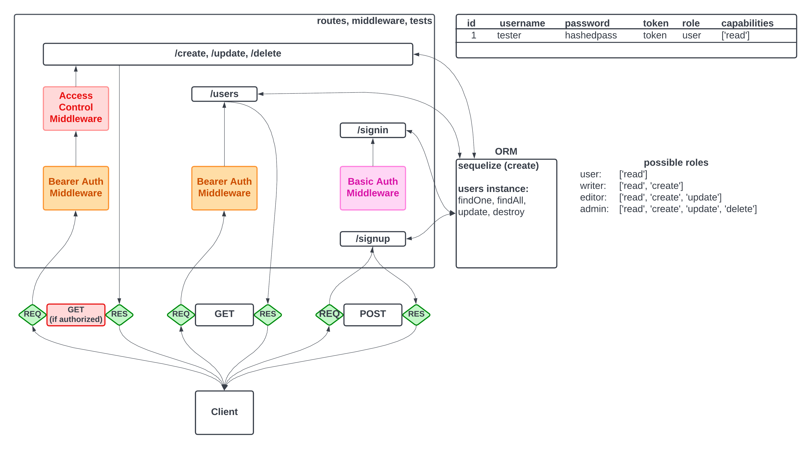

# auth-api

## Description
This repository provides a boilerplate for an integrated authentication API with an example content server.

### UML

A basic UML of the routing provided below.


## Testing

Testing was conducted with the ```supertest``` and ```jest``` node modules, and ```postman```.

## Usage

A live version of the API is deployed on heroku:

* [https://ben-auth-api-app.herokuapp.com](https://ben-auth-api-app.herokuapp.com)
